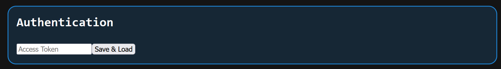
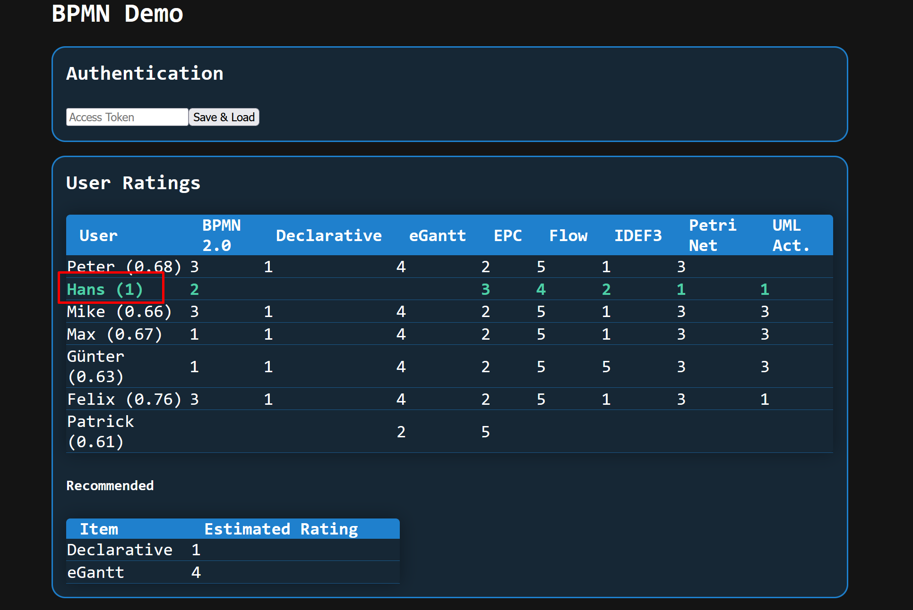

# Demo

For a working example, visit [demo](https://bpm.matthiasklenz.de).

## Navigation

1. To access the demo, you need to put in an API key in the first box.

2. You can click Usernames and Items to get the similarity of other Users/ Items.
The Similarity shows up in brackets next to the User.

3. If you clicked a User, another table appears with an estimation of each unrated item, what the user will most likely rate the item
4. At the bottom are some more boxes, they may not work as of a CORS issue

## Not Implemented Features & Bugs

- Items currently don't show the similarity to other items when clicked
- The panels at the bottom (sometimes) don't work
- The Recommendation Table don't show the item based algorithm
- Settings to fine tune the Algorithms are missing (Similarity Measure, knn, ...)